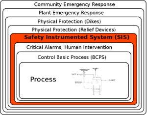
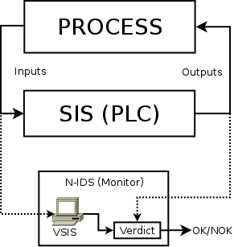

# Fiacre based Intrusion Detection System for Safety Instrumented System

## Description

This project holds the source code used in the paper "Intrusion Detection System for Safety Instrumented System" [[1]](#1). This paper presents a method to implement an Intrusion Detection (IDS) System for Safety Instrumented System (SYS) from the Safety Specification Documentation.

SYS acts as a protective layer to mitigate potential hazards. Figure 1 shows an example of safety layers; SIS operates in parallel with the Basic Process Control System (BCPs) and is the last mitigation layer capable of reducing the probability of an accident from ever occurring; subsequent layers are implemented to reduce the consequences of the accident [[2]](#2).



Figure 1. Layers of protections [[2]](#2).

Figure 2 illustrates the architecture view of the components that are part of this project. The Process, the SIS, and the IDS communicate through an OPC network. The IDS proposed in this project comprises the monitor and the VSIS. VSIS is a binary generated from the FIACRE model and the monitor is a python script. Communication between the monitor and VSIS takes place via a socket channel.



Figure 2. Architecture View.

To simplify the installation and use of the monitor, we add a simplified version of the monitor that does not require the installation of the OPC server neither a PLC. This simplified version emulates the PLC (with the expected behavior) and the OPC network. More information below.

## Folders

This project is organized in three folders, they are:

- vsis-fiacre: source code for the FIACRE model and the hippo library. Please, see hippo guidelines at [[3]](#3) for more information;

- monitor-local: python script for the monitor, together with a simplified implementation in python of both the plc and the OPC network;

- monitor-opc: python script for the monitor configured to use an OPC network. (Requires a running plc and an OPC server to run). Due to intellectual property and security concerns, the real PLC source code used for the experiments is not supplied.

## Instalation

It is not necessary to install any tool only to run this project on **LINUX** as it comes. However, if you decide to change the FIACRE model (VSIS folders), you have to install a building package for C language (such as GCC) for your changes to take effect. Also, if you decide to formally verify the VSIS, you have to install the Tina toolbox [[4]](#4) to execute the model checking toolchain.

### Configuration

The configuration consists of defining the IP socket address and the OPC server.

#### Scoket Address

Before running this project, confirm the socket address for the VSIS at `vsis-fiacre/oil_gas_experiment/vsis/main.c`. If you experience some problems, check the socket address at `monitor-local/fiacre.py` if you are using the local monitor or `monitor-opc/fiacre.py` if you are using a real PCL (hardware or emulator) connected to an OPC network\*. By default, the socket connection is set to use the port 5000.

If you are running both the monitor and VSIS at the same machine, set the socket address to empty ` ` or `0.0.0.0`. If the VSIS is running in a virtual machine hosted at the same machine as the monitor, set `10.0.2.2` as the socket address for the VSIS at `vsis-fiacre/oil_gas_experiment/vsis/main.c`. It is not necessary to change the socket address at the `fiacre.py` file. There are two versions of VSIS already compiled at `vsis-fiacre/oil_gas_experiment/vsis/bin` for these two cases.

#### OPC Server

You have to define the OPC server and address if you intend to execute the VSIS using a real PLC. Remind that this repository does not provide a real PLC source code. It provides only an emulated version written in Python to reproduce the experiments presented in section 6 of the respective article. The '' folder available if you want to implement your PLC (using the software of your choice like Simatic Step7, Codesys, etc ) to execute with the VSIS.

## Usage of the Local Monitor

Please, follow the procedures below to execute the local monitor and vsis.

1. Start the IDS (Monitor), the PLC (emulated version), and the Writer (to force inputs).

```
cd monitor-local
python experiment_oilNgas.py
```

2. Start the VSIS on a separate terminal.

```
cd vsis-fiacre/oil_gas_experiment/vsis/bin/
chmod +x mce_oilngas_localhost
./mce_oilngas_localhost
```

You should see logs on both terminals.

## Reproduce the Experiments

To reproduce the experiments reported on the paper, you have to change a few parameters used by the monitor and the VSIS, they are: _periodic constraint_, _number of sliding windows_ and _dtick_. The first two are related to the monitor and more information on how to change them can be found by executing the command below.

```
cd monitor-local
python experiment_oilNgas.py -h
```

The _dtick_ is the execution used to compile the FIACRE model into the VSIS binary. To change the clock, you have to modify the `D_TICK_UNIT_` variable at `vsis-fiacre/oil_gas_experiment/vsis/Makefile` and recompile the VSIS binary. (See hippo guidelines at [[3]](#3) for more information)

## Model Checking the VSIS

To repeat the formal verification presented in the article, just run the 'verify' script inside the folders 'vsis/oil_gas_experiment/model_checking' or 'vsis/didatic_example/model_checking' to verify the experiment presented in the evaluation section or the didactic example, respectively.

## Known Issues

The socket communication between the monitor and the VSIS (Fiacre-hippo binary) is unstable with Python3. For the moment, please use Python2 to run the monitor.

## References

<a id="1">[1]</a>
TODO: add paper link
Intrusion Detection System for Safety Instrumented System

<a id="2">[2]</a>
Paul Gruhn, P. E. "Safety instrumented systems: design, analysis, and justification." (2006).

<a id="3">[3]</a>
TODO: add
hippo,

<a id="4">[4]</a>
Tina Toolbox, http://projects.laas.fr/tina//
