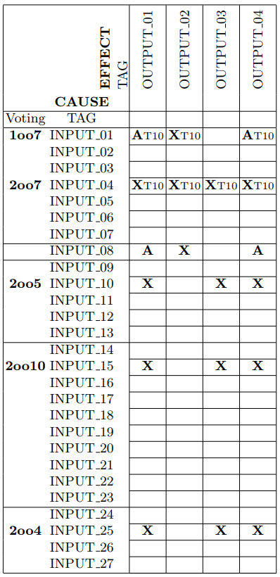

# Experiment

This folder contains the source code for the experiment presentend at section 6 in the article.

### Dependency

You need to install the following tools to reproduce the model checking experiments and to generate the executable VSIS:

1. Tina toolbox (http://projects.laas.fr/tina//);
2. Fiacre (http://projects.laas.fr/fiacre/)
3. Hippo (http://www.laas.fr/hippo). To avoid compatibility problems with the 'frac' name, rename the 'frac' binary from the hippo lib to 'frac2hippo';
4. Gpp preprocessor (https://logological.org/gpp);
5. building package for C language (such as gcc) to compile the models.

## Moldel

The Fiacre model presented in this folder holds the behavior specified by the Cause and Effect Matrix illustrated in Figure 1. For more information, see section 6 of the respective article.



Figure 1. Cause and Effect Matrix (Safety Specification).

## Model Checking

The 'model_checking' folder holds the source code to perform the formal verification of the VSIS. The fiacre model is extended with the LTL properties and inputs variables to emulate the environment. To execute the Model checking Toolchain, call the commands below:

1. List the available options:

```
cd model_checking
./verify
# No arguments supplied.
# Please, select a valid argument: input, v2oo4, v2005, v2007 or v2oo10.
```

2. Select one of the options available:

```
./script input
```

For each one of the available options, the script will apply the appropriate abstraction and perform the formal verification of the model. See the model's source code in the 'models' folder for more information. The fiacre models are self-explanatory.

## VSIS Executable

The folder 'vsis' holds the source code to generate an executable version of the fiacre model. Execute the 'generate' script to create the executable from the fiacre model using hippo. To execute the VSIS online with the PLC, this repository is provided with an emulation version written in python of the PLC used in the experiment. Please, follow the instructions depicted at the root folder in the section 'Reproduce the Experiments'.
